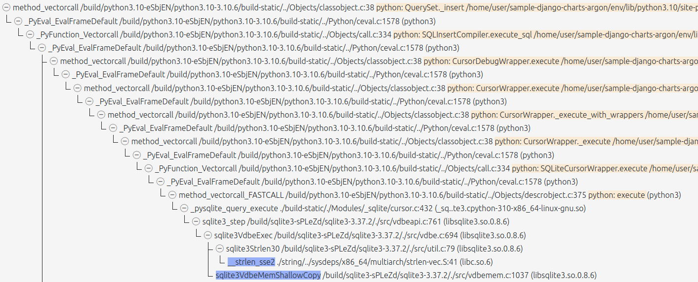
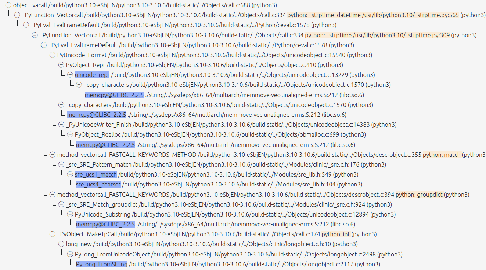
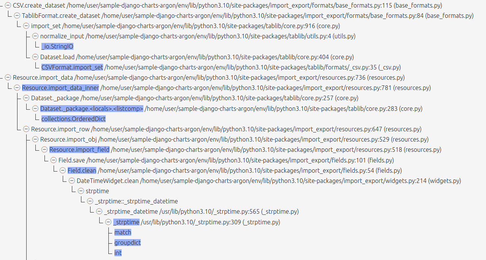
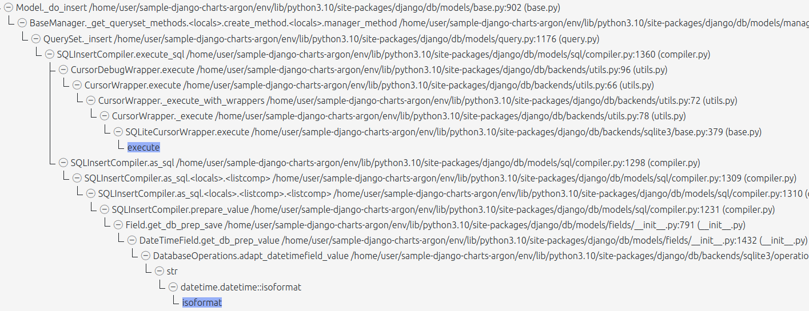
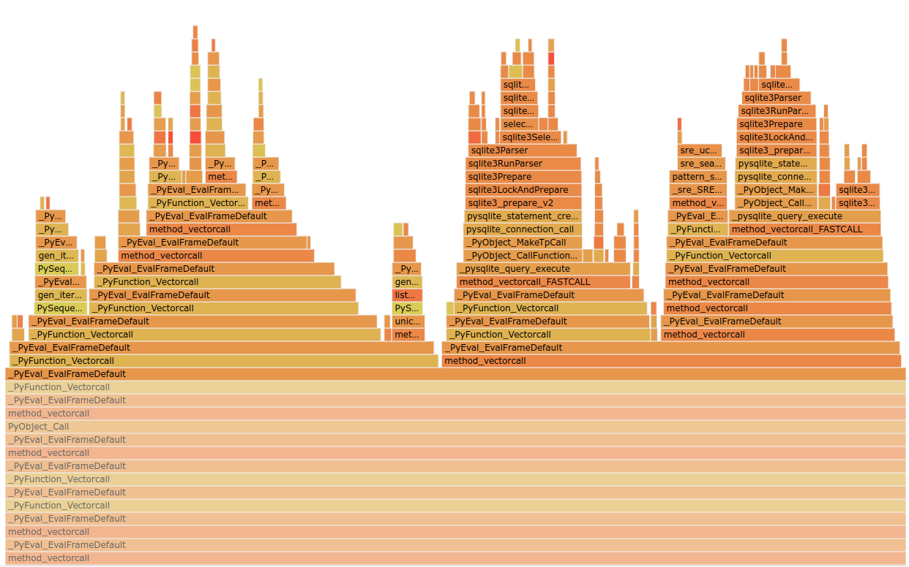

# QRS 2023 materials

This is a subset of reports generated by Natch in the process of analysis of simple Django application.

# Call graphs with highlighted tainted functions

# Call graphs of the Python functions

# Flame graph

# List of Python scripts and modules

[scripts.md]

# PDF with full Report of the Process Activities

[report-django-18-7-2023.pdf]
